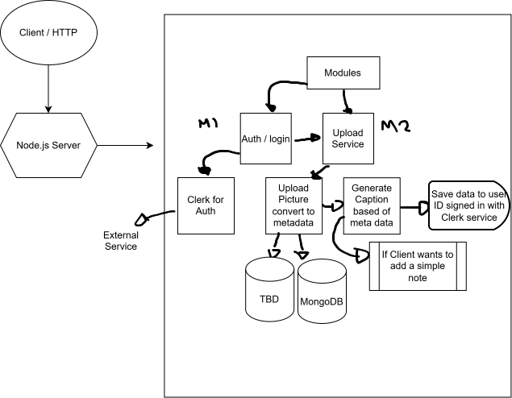
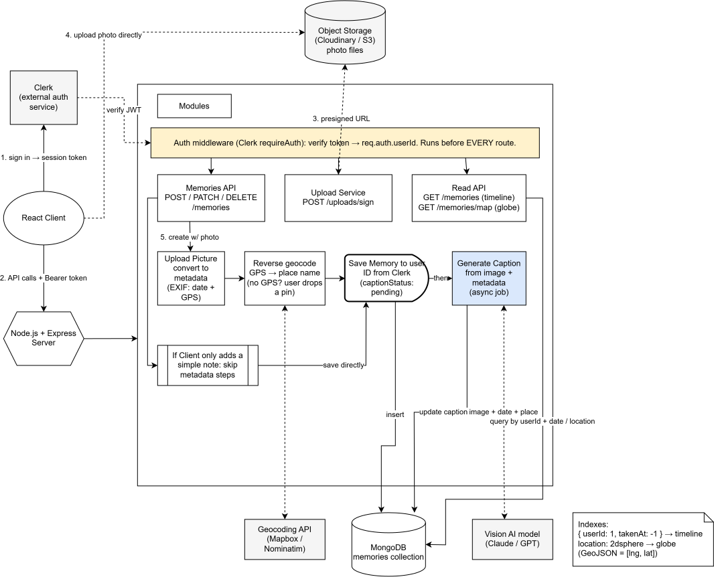

# Memoria
MERN (MongoDB, Express, React, Node) digital memory journal that turns your camera roll into an explorable timeline. Upload photos and notes, generate AI captions, plot memories on a 3D globe, and organize them by date, place, and time.

# Tasks for Backend 
- Create mongodb Cluster / connection / set up URI string -> update in .env file

# System Design Backend
Below is the System Design I originally created compared to a more detailed flow. As you can see, they are very similar, with a few key differences. My original design captured the core modules but blurred the line between my server and external services, left file storage undecided, and mainly focused on the write path. The refined design addresses these gaps by adding object storage, authentication middleware across routes, asynchronous AI captioning, and dedicated read endpoints for the timeline and globe.

### My original design System Design Flow Chart - Backend

### Refined design - Backend

